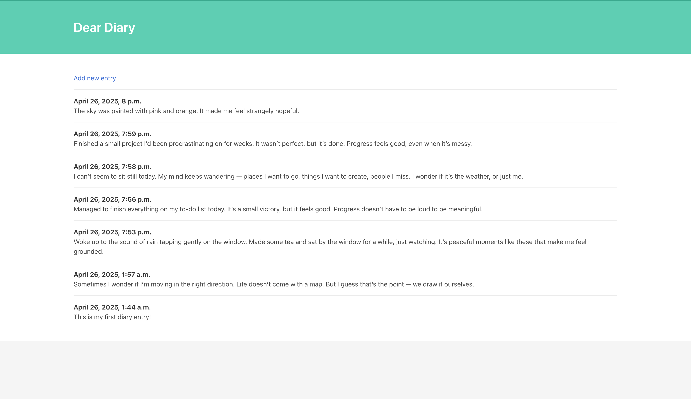
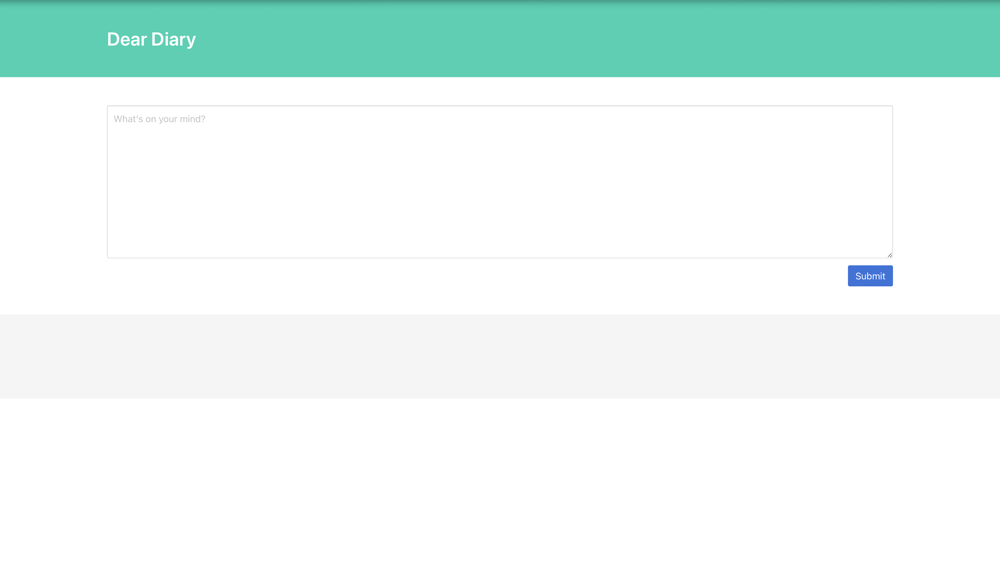
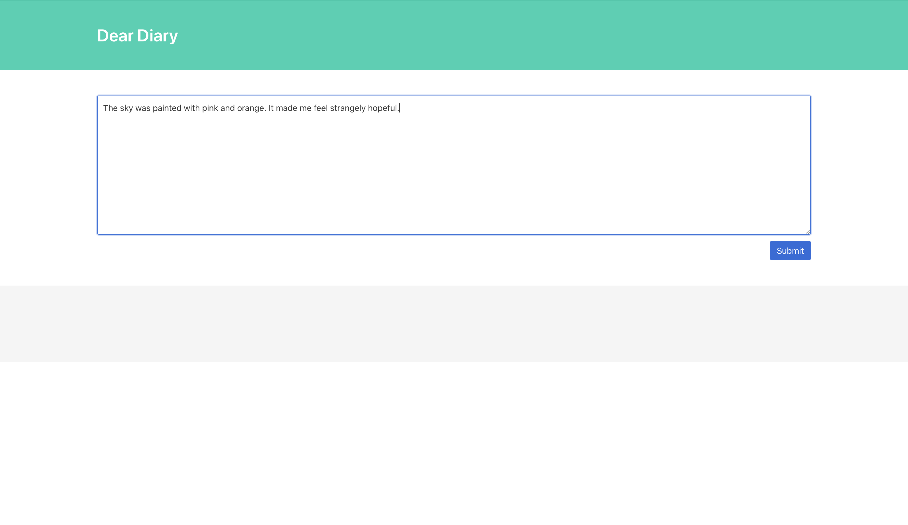

# Dear Diary 📝

A simple Django demo project built to learn the basics of Django web development.

---

## Overview

**Dear Diary** allows users to:
- View all existing diary entries.
- Add new diary entries through a form.

This project focuses on understanding the fundamental concepts of Django, including:
- Setting up a Django project and app.
- Creating models to store data in a database.
- Displaying dynamic content in templates.
- Using Django's admin dashboard.
- Setting up URL routes and views.
- Creating and processing forms using Django's built-in features.

## Screenshots

### View All Diary Entries

---

### Add a New Entry (Form)

---

### Submitting a New Entry

---

## Note

This project was created for learning purposes and focuses on core Django concepts, without advanced features like authentication, validation errors, or styling beyond the default.